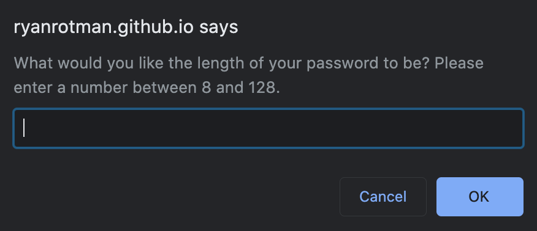
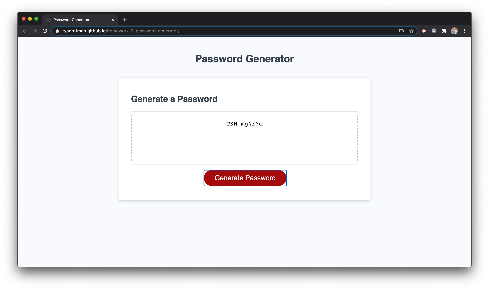
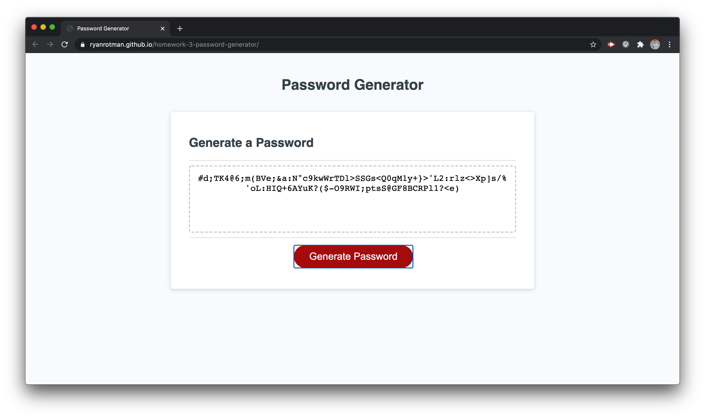

# Homework 3: Password Generator

## Description
This repository holds the second homework assignment for [The Coding Boot Camp](https://techbootcamps.utexas.edu/coding/) through the University of Texas at Austin's Center for Professional Education.

This project uses javascript to create an app that generates a random password based on user input. This was definitely a tougher project as javascript has been incredibly intensive and has taken a lot to try and wrap my head around it all. I understood all the acceptance criteria, but figuring out how to write each section of code definitely took a long time to do.

## Notes
One part that definitely took some time was making sure that the prompts continued only when the user entered an acceptable number between 8 and 128. To complete that, I used a do/while loop.
> 
> 

## Page Screenshots
Main Page

Page with a generated password of 10 characters

Page with a generated password of 100 characters

## Link
Github Pages Link: [https://ryanrotman.github.io/homework-3-password-generator/](https://ryanrotman.github.io/homework-3-password-generator/)